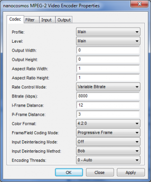

## nanocosmos MPEG-2 Video Encoder Filter

### DirectShow Filter / Module

nanocosmos MPEG-2 Video Encoder\\
Module Name: nmpeg2enc.ax

### DirectShow Connectivity

The input is accepting connections to video source, capture and decoder filters matching the following media types:

Major types:
  * MEDIATYPE_Video

Subtypes:
  * MEDIASUBTYPE_YV12,
  * MEDIASUBTYPE_I420,
  * MEDIASUBTYPE_YUY2,
  * MEDIASUBTYPE_UYVY,
  * MEDIASUBTYPE_HDYC,
  * MEDIASUBTYPE_RGB24,
  * MEDIASUBTYPE_RGB32,
  * MEDIASUBTYPE_ARGB32,
  * MEDIASUBTYPE_RGB565,

Formats:
  * FORMAT_VideoInfo
  * FORMAT_VideoInfo2

The output supports these media types:

Major types:
  * MEDIATYPE_Video

Subtypes:
  * MEDIASUBTYPE_MPEG2_VIDEO,
  * MEDIASUBTYPE_mpgv

Formats:
  * FORMAT_MPEG2_VIDEO,
  * FORMAT_NONE

### Configuration

The encoding configuration may be set by using either the property page or the COM Interface INanoCodecOpts as declared in header file INanoCodecOpts.h .

```cpp
// Filter GUID
// {2327A344-BECC-4f4f-89C6-DABDC5143832}
DEFINE_GUID(CLSID_NANO_MPEG2_ENCODER, 0x2327a344, 0xbecc, 0x4f4f, 0x89, 0xc6, 0xda, 0xbd, 0xc5, 0x14, 0x38, 0x32);

// Property Page GUID
// {8A84396A-277A-4835-9EB5-719863194DC9}
DEFINE_GUID(CLSID_NANO_MPEG2_ENCODER_PROPPAGE, 0x8a84396a, 0x277a, 0x4835, 0x9e, 0xb5, 0x71, 0x98, 0x63, 0x19, 0x4d, 0xc9);

// Configuration Interface GUID
// {698E0F57-B828-4c40-8867-095FF49F77D6}
DEFINE_GUID(IID_INanoCodecOpts, 0x698e0f57, 0xb828, 0x4c40, 0x88, 0x67, 0x9, 0x5f, 0xf4, 0x9f, 0x77, 0xd6);

// Configuration interface ICodecProp
// {0F817204-82C8-4c12-884A-F45FB2F33A6E}
DEFINE_GUID(IID_ICodecProp, 0xf817204, 0x82c8, 0x4c12, 0x88, 0x4a, 0xf4, 0x5f, 0xb2, 0xf3, 0x3a, 0x6e);

// ICodecProp: IID_nanoPeg_LicenseString
// type: BSTR / Unicode string
// Set license string to unlock filter
// {1788F0B0-5985-4a19-B7FE-8AAC1BFC14B3}
DEFINE_GUID(IID_nanoPeg_LicenseString, 0x1788f0b0, 0x5985, 0x4a19, 0xb7, 0xfe, 0x8a, 0xac, 0x1b, 0xfc, 0x14, 0xb3);
```


### Setting the license to unlock filter

The filter can be unlocked either through a license key entry in the windows registry or
by setting the license key through COM interface ICodecProp::SetProperty with the
property **IID_nanoPeg_LicenseString** as first parameter. The second license parameter
has to be a wide/unicode string!

### Common Encoder Settings

| Parameter                    | Default values              | Description                     |
|------------------------------|-----------------------------|---------------------------------|
| profile, level               | Main Profile, Main Level    | MPEG-2 Profile and Level        |
| base_video.bitrate_kb        | Profile and Level dependend | Video Bitrate in kBits/second   |
| base_video.resolution.width  | 0 - use input width         | Picture Coding Width            |
| base_video.resolution.height | 0 - use input height        | Picture Coding Height           |
| chroma_format_idc            | 0 - I420, 1 - I422          | [0,1] Chroma Format             |
| rate_method                  | 0 - CBR, 1 - VBR            | [0,1] Rate Control Mode         |
| distance_i                   | 12                          | Intra Frame Distance / GOP len. |
| distance_p                   | 3                           | P Frame Distance                |

### Configuration through INanoCodecOpts interface

  - Version check by calling //GetCodecOptsVersion//// //(optional)
  - Instanciating a parameter structure of type //MPDX4_MPEG2EncoderParams//
  - Initializing the parameter struct by calling //InitCodecOptions// will set all parameters to default values for the selected profile and level
  - Setting custom values for resolution and bitrate
  - Applying settings by calling //SetCodecOptions//

Here a code snippet without error handling to show configuration for IMX 50 format:
```cpp
#include "mpeg2_enc_params.h"

HRESULT hr = S_OK;

// Query INanoCodecOpts interface from IBaseFilter interface
// of MPEG-2 Encoder filter
CComQIPtr<INanoCodecOpts> pNanoCodecOpts = pBaseFilter;

MPDX4_MPEG2EncoderParams mpeg2EncParams;
memset(&mpeg2EncParams, 0, sizeof(MPDX4_MPEG2EncoderParams));

// Set desired profile and level values
mpeg2EncParams.profile = MPDX4_MPEG2_PROFILE_422IMX;
mpeg2EncParams.level = MPDX4_MPEG2_LEVEL_MAIN;

// Intialize the parameter struct according to profile and level set
hr = pNanoCodecOpts->InitCodecOptions((MPDX4_BaseCodecOpts*) &mpeg2EncParams, INANOCODECOPTS_VERSION);

// Set custom parameter values
// Bitrate
mpeg2EncParams.base_video.bitrate_kb = 50000; // IMX 50
// If resize is needed
mpeg2EncParams.base_video.resolution.width = 720;
mpeg2EncParams.base_video.resolution.height = 608;

// Apply settings and finish configuration
hr = pNanoCodecOpts->SetCodecOptions((MPDX4_BaseCodecOpts*) &mpeg2EncParams, INANOCODECOPTS_VERSION);
```


### Configuration through DirectShow  filter property page

The filter's property page offers a subset of encoding parameters, containing the most important options.



### Debug-Log Configuration Registry Settings

Key: HKEY_CURRENT_USER\Software\DebugNano\nmpeg2enc.ax

#### File name

Sets the output file name. The folder must already exist.
  * Value name: 	LogToFile
  * Value type: 	       REG_SZ / String
  * Valid values:	a valid output file name to enable file logging or an empty string

#### Logging level

A higher value increases the amount of logging messages sent, and messages get more detailed.
  * Value name: 	TRACE
  * Value type: 	REG_DWORD
  * Valid values:
    * 0 - minimal logging
    * …
    * 9 - maximal logging
