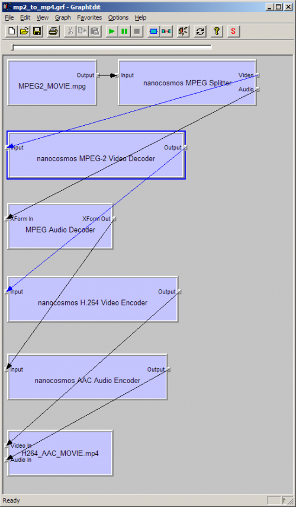

## nanoAVC/H.264 DirectShow Encoding SDK

### Introduction

nanoAVC/H.264 Direct Show Encoding SDK enables you to perform high quality and high performance video coding for the latest generation video and audio coding standards. It is intended to develop  video encoding / transcoding applications based on Microsoft(R) DirectX/DirectShow(R) technology.

### Major Features

  * ISO 14496 Part 10 (MPEG-AVC) / ITU H.264 compliance for many profiles and levels
  * Encoding of H.264 video streams in Baseline, Main, Extended and High profile
  * Encoding of AAC-LC/LTP/MAIN/HE(aacPlus) audio streams with up to 6 channels
  * Encoding of AMR-NB audio streams
  * Highly optimized software coding with support for latest CPU  technology by Intel and AMD (SSE2/SSE3/SSE4 and Dual-Core/Core-Duo, AMD Athlon64
  * Real-time Encoding from Capture cards is supported
  * Wide range of applications from Mobile Phones (3GP), Portable Devices (iPod, iPhone, Sony PSP etc) up to Professional HDTV
  * Multiplexer for MP4, MOV and 3GP

### Documentation

The SDK\doc folder contains the following further documents:

  * H.264/AVC Video Decoder
  * H.264/AVC Video Encoder
  * AAC Audio Encoder
  * AMR-NB Audio Encoder
  * MP4/3GP Multiplexer

### Filter components

  * nanocosmos AVC/H.264 Video Encoder
    * Module:		nh264enc.ax
    * CLSID:		{A88889A8-3C2A-4A32-8EAA-755D491D02A0}

  * nanocosmos AAC Audio Encoder
    * Module:		naacenc.ax
    * CLSID:		{0296CC21-B78D-416D-846C-45E26CA46A4A}

  * nanocosmos AMR-NB Audio Encoder
    * Module:		namrnbenc.ax
    * CLSID:		{10CAB930-E019-41DF-83B7-60D723706B8F}

  * nanocosmos MP4 Multiplexer
    * Module:		nmp4mux.ax
    * CLSID:		{78D670BF-49B5-4A3B-BB8C-E2A36E688FCF}

  * nanocosmos File Dump Filter
    * Module:		nanodump.ax
    * CLSID:		{DA67A541-8FEA-11D4-A908-00105A6758CF}

  * nanocosmos AVC/H.264 Video Decoder
    * Module:		nh264dec.ax
    * CLSID:		{264DA7DD-CE74-472D-A2FD-796A1F0A379C}

  * nanocosmos AAC Audio Decoder
    * Module:		naacdec.ax
    * CLSID:		{AEED2B3D-6DA1-4C84-A85D-83547FA90486}

  * nanocosmos MP4 Stream Splitter
    * Module:		nmp4splitter.ax
    * CLSID:		{22F493C4-B51B-4767-BE55-ADFA34D6A205}

  * nanocosmos MPEG PS/TS Stream Splitter
    * Module:		nmpegsplitter.ax
    * CLSID:		{0994D1E8-B697-47DE-B1E3-36D26937D5B4}

  * nanocosmos Color Space Converter
    * Module:		ncolconv.ax
    * CLSID:		{E855821E-C055-4C85-B04F-19F65D5D50FD}

  * nanocosmos MPEG TS Writer
    * Module:		nanoTsWriter.ax
    * CLSID:		{2C6E92AB-523E-4C90-8A01-394FC0FC273C}

Figure 1.  Example  filtergraph

### Registering and unregistering components in the DirectShow framework

In order to use them, filters must be registered in the DirectShow framework. After installation all filters are registered. To re-register or unregister components, execute the RegisterFilters.bat or UnregisterFilters.bat batch files from the SDK/bin folder.

### Evaluation mode and filter activation

Filters can be activated by installing a license key to windows registry or programmatically by setting a license key through the software interface of a filter instance. How to set license keys to unlock filters is described in the module's documents.\\
If filters run in evaluation mode, an overlay logo will be shown on video.

### Embedding / Customizing nanoPEG technology

Nanocosmos also offers special OEM and customization service. Dependent on your needs, we may offer different models of licensing or application development.
