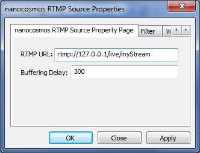

## nanocosmos RTMP Source Filter

### Introduction
  * DirectShow filter for RTMP Downstreaming / Playback
  * Supported Architectures: Microsoft DirectShow, Windows XP, Vista, 7, Server
  * Supported Formats: H.264 + AAC + MP3

### Module Name / Version

Module: nRTMPSource.ax \\
Version: 1.3.1.1

### DirectShow Connectivity

The output pins are accepting connections matching the following media types:

  * Major types:
    * MEDIATYPE_Video
  * Subtypes:
    * FourCCs: H264, h264
  * Formats:
    * FORMAT_MPEG2_VIDEO,
    * FORMAT_NONE
  * Major types:
    * AAC: 	   MEDIATYPE_Audio
    * MP3:     MEDIATYPE_Audio
    * SPEEX: MEDIATYPE Ogg Stream
  * Subtypes:
    *  AAC:    MEDIASUBTYPE_AAC,  FourCC: 0x000000FF,
    * MP3:     MEDIASUBTYPE_MP3,  FourCC: 0x00000055
    * SPEEX:  MEDIASUBTYPE_None
  * Formats:
  * AAC, MP3: 	FORMAT_WaveFormatEx,
  * SPEEX: 	FORMAT_Speex

### Filter GUIDs

```cpp
// Filter GUID
// {440E11F2-FB35-4699-809B-157C390E9238}
DEFINE_GUID(CLSID_NANO_RTMP_SOURCE, 0x440e11f2, 0xfb35, 0x4699, 0x80, 0x9b, 0x15, 0x7c, 0x39, 0xe, 0x92, 0x38);

// Property Page GUID
// {7A05E2F3-9258-4952-920A-54F6AE6A0D66}
DEFINE_GUID(CLSID_NANO_RTMP_SOURCE_PROPPAGE, 0x7a05e2f3, 0x9258, 0x4952, 0x92, 0xa, 0x54, 0xf6, 0xae, 0x6a, 0xd, 0x66);
```

### Configuration through COM Interface

The streaming url can be set by using standard DirectShow interface IFileSourceFilter .

#### URL format

rtmp:%%//%% [ IP:port ]/[ application name]/[ stream name]\\
If no port is specified, standard rtmp port 1935 will be used.

Example:\\
rtmp:%%//%%127.0.0.1:1935/live/myStream

Following options can be set by using standard DirectShow interface ICodecAPI.
See DirectShow documentation for usage of ICodecAPI interface.

#### Connect to nanocosmos decoder filters only

Value Type:     Integer, Variant::intVal, VT_INT\\
Valid values:   yes: 1, no: 0 \\
GUID:

```cpp
// {FB5005A0-3231-4171-A218-A3A3431D7790}
DEFINE_GUID(PROPID_nanoSourceConnectToNanoDecodersOnly, 0xfb5005a0, 0x3231, 0x4171, 0xa2, 0x18, 0xa3, 0xa3, 0x43, 0x1d, 0x77, 0x90);
```


#### Buffering delay in milliseconds

Under low bandwidth conditions a higher value leads to smoother playback.

Value Type:     Integer, Variant::intVal, VT_INT\\
Valid values:   0...INT32_MAX\\
GUID:

```cpp
// {3641DC07-82CD-40b0-9293-DCBE25E0C274}
DEFINE_GUID(PROPID_nanoSourceBufferingDelay, 0x3641dc07, 0x82cd, 0x40b0, 0x92, 0x93, 0xdc, 0xbe, 0x25, 0xe0, 0xc2, 0x74);
```

#### Buffering mode

Use this GUID to configure the buffering mode\\
Value Type:     VT_I4 / VARIANT::intVal, get/set \\
Valid values:   0 - Fill buffer once on start, 1 - Refill buffer always if empty\\
Default value: 1\\

```cpp
// {AB91A1D9-6701-4133-8733-6EB3A20E9583}
DEFINE_GUID(PROPID_nanoSourceBufferingMode, 0xab91a1d9, 0x6701, 0x4133, 0x87, 0x33, 0x6e, 0xb3, 0xa2, 0xe, 0x95, 0x83);
```

#### Receive timeout in milliseconds

A stream is stopped if no data is present for this amount of time Overrides registry value ReceiveTimeout
Value Type:      Integer, Variant::intVal, VT_I4\\
Valid values:   1000...INT (1-30 seconds), default: 5000 (5 seconds)\\
GUID:

```cpp
// {767B756C-A55B-4fd9-88F8-159B338207ED}
DEFINE_GUID(PROPID_nanoRTMPReceiveTimeoutMs, 0x767b756c, 0xa55b, 0x4fd9, 0x88, 0xf8, 0x15, 0x9b, 0x33, 0x82, 0x7, 0xed);
```

#### Stream format detection timeout in milliseconds

The detection is stopped after this amount of time, even if less than 2 streams found Overrides registry value DetectStreamFormatTimeout
Value Type:     Integer, Variant::intVal, VT_I4\\
Valid values:   1000...INT32_MAX, default: 10000 (10 seconds)\\
GUID:
```cpp
// {7400166F-8140-4b81-8B3E-C97CB7D972DF}
DEFINE_GUID(PROPID_nanoRTMPDetectStreamFormatTimeoutMs, 0x7400166f, 0x8140, 0x4b81, 0x8b, 0x3e, 0xc9, 0x7c, 0xb7, 0xd9, 0x72, 0xdf);
```


#### Configuration through DirectShow filter property page




#### Configuration Registry Settings

Key: HKEY_CURRENT_USER\Software\nanocosmos\nRTMPSource

#### Receive timeout

A stream is stopped if no data is present for this this amount of time\\
Value name: 	DetectStreamFormatTimeout\\
Value type: 	REG_DWORD\\
Valid values:	1 second - 30 seconds, default: 5 seconds

#### Stream format detection mode

Determines if stream format settings are detected from the RTMP network stream or from registry preset values below.\\
Value name: 	DetectStreamFormatMode\\
Value type: 	REG_DWORD\\
Valid values:	0: Detect from stream (default), 1: Use registry preset\\

#### Stream format detection timeout

Timeout for format detection in seconds\\
Value name: 	DetectStreamFormatTimeout\\
Value type: 	REG_DWORD\\
Valid values:	1 second - 30 seconds, default: 10 seconds

#### Audio Codec

Sets the audio codec if DetectStreamFormatMode = 1.\\
Value name: 	AudioCodec\\
Value type: 	REG_DWORD\\
Valid values:	0: Auto/Default(AAC), 1: AAC, 2: MP3, 3: SPEEX

#### Audio Channels

Sets the number of audio channels if DetectStreamFormatMode = 1.\\
Value name: 	AudioChannels\\
Value type: 	REG_DWORD\\
Valid values:	0: Auto/Default(Stereo), 1: Mono, 2: Stereo

#### Audio Bitlength

Sets the number of bits per audio sample if DetectStreamFormatMode = 1.\\
Value name: 	AudioBitlength\\
Value type: 	REG_DWORD\\
Valid values:	0: Auto/Default(16 Bit), 1: 8 Bit, 2: 16 Bit

#### Audio Samplerate

Sets the audio samplerate if DetectStreamFormatMode = 1.\\
Codecs support different sampling rates and have different default values!!!\\
Value name: 	AudioRate\\
Value type: 	REG_DWORD\\

##### Valid values AAC:
  * 0: Auto/Default(44100),
  * 1: 8000 ,
  * 2: 11025,
  * 3: 12000,
  * 4: 16000,
  * 5: 22050,
  * 6: 24000
  * 7: 32000,
  * 8: 44100,
  * 9: 48000,
  * 10: 64000,
  * 11: 88200,
  * 12: 96000

##### Valid values MP3:
  * 0: Auto/Default(44100),
  * 1: 5500 ,
  * 2: 11025,
  * 3: 22050,
  * 4: 44100

##### Valid values SPEEX:
  * 0: Auto/Default(16000),
  * 1: 8000 ,
  * 2: 16000,
  * 3: 32000,
  * 4: 44100
SPEEX internal sampling is usually 16000 (wideband).
It differs from flash's Microphone::rate value!


### Debug-Log Configuration Registry Settings

Key: HKEY_CURRENT_USER\Software\DebugNano\nRTMPSource.ax  

#### File name
Sets the output file name. The folder must already exist.\\
Value name: 	LogToFile\\
Value type: 	REG_SZ / String\\
Valid values:	a valid output file name to enable file logging or an empty string

#### Logging level

A higher value increases the amount of logging messages sent, and messages get more detailed. \\
Value name: 	TRACE\\
Value type: 	REG_DWORD\\
Valid values:
  * 0 - minimal logging
  * …
  * 9 - maximal logging
