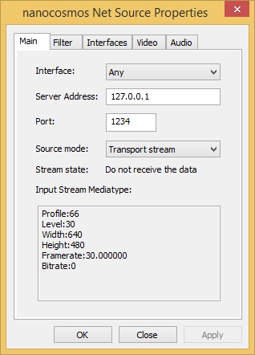
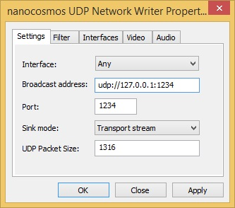

## nanocosmos UDP/TS Network Writer and Reader Filter

#### Introduction
DirectShow filters for UDP/TS Streaming
  * Supported Architectures: Microsoft DirectShow, Vista, 7, 8, 10, Server
  * Supported Protocols: UDP Unicast and Multicast
  * Supported Video Codecs: H.264 and MPEG-2 Video
  * Supported Audio Codecs: AAC and MPEG Audio
  * Supported Payload: MPEG Transport Stream (A/V Interleaved) or Video Elementary Stream (Video only)


#### Modules

UDP Network Source Filter: nanoNetSource.ax  	\\
UDP Network Writer Filter: nanoNetSink.ax  	\\

#### DirectShow Connectivity

The DirectShow pins are accepting connections matching the following media types:

  Video Major Types:  
    MEDIATYPE_Video  
  Subtypes:  
    H.264: MEDIASUBTYPE_H264,  FourCC: 0x34363248  
    H.264: MEDIASUBTYPE_h264,  FourCC: 0x34363268  
    MPEG-2: MEDIASUBTYPE_MPEG2_VIDEO  
  Formats:  
    FORMAT_MPEG2_VIDEO  
    FORMAT_NONE

  Audio Major Types:  
    MEDIATYPE_Audio  
  Subtypes:  
    AAC: MEDIASUBTYPE_AAC,  FourCC: 0x000000FF  
    MPEG-1 Audio: MEDIASUBTYPE_MPEG1AudioPayload  
    MPEG-2 Audio: MEDIASUBTYPE_MPEG2_AUDIO  
  Formats:
  AAC, MPEG Audio: 	FORMAT_WaveFormatEx  

### Configuration

#### Configuration through the Property Page   



**Interface**: Desired network interface or Any

**Address**: Local IP address or 0.0.0.0

**Port**: Network port number

**Mode**: Transport Stream (default) or Elementary Stream

**Stream State**: Indicates the current stream state (online/offline)

**Input Stream Mediatype**: Display of the current video format if online




**Interface**: Desired network interface or Any

**Address**: Hostname or IP address of the receiving machine or multicast address

**Port**: Network port number

**Mode**: Transport Stream (default) or Elementary Stream

**UDP Packet Size**: Should not exceed MTU size. By default 1316 bytes (7 TS packets)


#### Configuration through COM Interface

##### Header Files

Network Source Filter:  
- NetSourceGuids.h  
- NetSourceOptions.h  
- bsMediaParams.h  
- ICodecProp.h  
- CommonProps.h  


Network Writer Filter:  
- NetWriterGuids.h    
- NetWriterOptions.h  
- ICodecProp.h  
- CommonProps.h  


##### COM Interfaces   

Network Source Filter:  
- INetSource  
- ICodecProp  
- IFileSourceFilter  
- ICodecAPI  
- IBaseFilter  
- ISpecifyPropertyPages  


Network Writer Filter:  
- INetSink  
- ICodecProp  
- IFileSinkFilter  
- ICodecAPI  
- IBaseFilter  
- ISpecifyPropertyPages  

##### Setting up the stream URL   

The streaming url can be set by using standard DirectShow interfaces //**IFileSourceFilter**// (Reader) and //**IFileSinkFilter**// (Writer)  
or the custom interfaces //**INetSource**// (Reader) and //**INetSink**// (Writer).

URL Format: udp:%%//%% [ hostnameorIP:port ]\\

Examples:  

Given two machines with different IP addresses, the sender 192.168.1.51 and the receiver 192.168.1.52.  

For a **UDP unicast** stream the Network Writer needs to be set up
to the destination IP address of the receiver, udp:%%//%%192.168.1.52:1234.    
On the receiver side the Network Source is set up to the local IP address,
udp:%%//%%192.168.1.52:1234 or udp:%%//%%0.0.0.0:1234.  

For a **UDP multicast** stream the sender and receiver are set up to the same multicast address, e.g. udp:%%//%%225.0.0.40:1234.  

##### Setting the license to unlock the filter
The filter can be unlocked either through a license key entry in the windows registry or by setting the license key through COM interface ICodecProp::SetProperty with the property IID_nanoPeg_LicenseString as first parameter. The second license parameter has to be a wide/unicode string!

```cpp
#include "ICodecProp.h" // ICodecProp interface
#include "CommonProps.h" // IID_nanoPeg_LicenseString property id

const wchar_t* strwLicense = L"nlic:....";

// Query ICodeProp interface from IBaseFilter instance
CComQIPtr <ICodecProp> pCodecProp = m_pBaseFilter;

if (pCodecProp)
{
    pCodecProp->SetProperty(&IID_nanoPeg_LicenseString, strwLicense);
}
else
{
    // Handle error
}
```


##### INetSource and INetSink Interfaces

The INetSource and INetSink interfaces provide additional functions for getting and setting configuration properties like network interface, hostname, port, operational mode (Transport Stream or Elementary Stream) and the current streaming state.  

```cpp
// Interface declared in NetSourceOptions.h  
// IID defined in NetSourceGuids.h  
// {7899B7E7-F8D4-4076-BE9D-D03D51413756}  
interface INetSource : public IUnknown
{
	virtual STDMETHODIMP SetPort(int port) = 0;
	virtual STDMETHODIMP SetNetworkInterface(const wchar_t* net_interface) = 0;
	virtual STDMETHODIMP SetServerAddress(const wchar_t* address) = 0;
	virtual STDMETHODIMP GetPort(int* port) = 0;
	virtual STDMETHODIMP GetNetworkInterface(BSTR* net_interface) = 0;
	virtual STDMETHODIMP GetServerAddress(wchar_t* address, int size) = 0;
	virtual STDMETHODIMP GetMode(net_source_mode_t* mode) = 0;
	virtual STDMETHODIMP SetMode(net_source_mode_t mode) = 0;
	virtual STDMETHODIMP GetStreamingState(net_source_state_t* state) = 0;
	virtual STDMETHODIMP GetElemetaryStreamProperties(BS::params_t* params, int pin) = 0;
	virtual STDMETHODIMP GetNumOfAvailableInterface(int* count) = 0;
	virtual STDMETHODIMP GetAvailableInterface(BSTR* nif, int n) = 0;
	virtual STDMETHODIMP InitInput() = 0;
};
```


```cpp
// Interface declared in NetWriterOptions.h  
// IID defined in NetWriterGuids.h  
// {A4F3C2AC-18F7-4113-92FD-4042BD7279AC}
interface INetSink : public IUnknown
{
	virtual STDMETHODIMP SetDest(const wchar_t* dest, int port) = 0;
	virtual STDMETHODIMP SetMode(net_sink_mode_t mode) = 0;
	virtual STDMETHODIMP GetDest(const wchar_t* dest, int size, int* port) = 0;
	virtual STDMETHODIMP GetMode(net_sink_mode_t* mode) = 0;
	virtual STDMETHODIMP GetNumOfAvailableInterface(int* count) = 0;
	virtual STDMETHODIMP GetAvailableInterface(BSTR* nif, int n) = 0;
	virtual STDMETHODIMP GetNetInterface(BSTR* nif) = 0;
	virtual STDMETHODIMP SetNetInterface(BSTR nif) = 0;
};
```


##### Network Source Filter Timeout Settings

Timeout settings can be configured through the standard DirectShow COM interface ICodecAPI or in the Windows Registry.  

1. **Load Timeout** in ms  
The load timeout leads to loading being aborted after the configured  timespan if no stream input was received during IFileSourceFilter::Load.  

```cpp
Registry Key: HKCU\SOFTWARE\nanocosmos\nNetSource  
Value Name: TimeoutLoad  
Value Type: REG_DWORD  
Default Value: 10000  

ICodecAPI interface parameter defined in NetSourceGuids.h  
Get/Set input timeout during load in ms  
VARIANT_TYPE: VT_I4, VARIANT::intVal  
default value: 10000 ms  
{CDC0C5AF-1666-4b46-8C7A-48EFF1C7E965}  
DEFINE_GUID(PROPID_nanoNSTimeoutLoad,  
0xcdc0c5af, 0x1666, 0x4b46, 0x8c, 0x7a, 0x48, 0xef, 0xf1, 0xc7, 0xe9, 0x65);  
```

2. **Input Timeout** in ms  
The input timeout leads to the filtergraph being stopped if no stream input was received for the configured time, e.g. because the stream was stopped at the sender.  

```cpp
Registry Key: HKCU\SOFTWARE\nanocosmos\nNetSource  
Value Name: TimeoutInput  
Value Type: REG_DWORD  
Default Value: 5000  

ICodecAPI interface parameter defined in NetSourceGuids.h  
Get/Set input timeout during streaming in ms  
VARIANT_TYPE: VT_I4, VARIANT::intVal  
default value: 5000 ms  
{454B2E50-C50F-41f6-BF96-BF84016780C6}  
DEFINE_GUID(PROPID_nanoNSTimeoutInput,  
0x454b2e50, 0xc50f, 0x41f6, 0xbf, 0x96, 0xbf, 0x84, 0x1, 0x67, 0x80, 0xc6);  
```

3. **Output Timeout** in ms  
The output timeout leads to the filtergraph being stopped if no MediaSamples were delivered for the configured time.  


```cpp
Registry Key: HKCU\SOFTWARE\nanocosmos\nNetSource  
Value Name: TimeoutOutput  
Value Type: REG_DWORD  
Default Value: 5000  

ICodecAPI interface parameter defined in NetSourceGuids.h  
Get/Set output timeout during streaming in ms  
VARIANT_TYPE: VT_I4, VARIANT::intVal  
default value: 5000 ms  
{D75ED01E-D608-436d-BCE7-DBC4AC71A29D}  
DEFINE_GUID(PROPID_nanoNSTimeoutOutput,  
0xd75ed01e, 0xd608, 0x436d, 0xbc, 0xe7, 0xdb, 0xc4, 0xac, 0x71, 0xa2, 0x9d);  
```


#### Network Source Filter File Dump Settings

The file dump allows to record the udp input stream to a file.  
It is intended to be used for diagnosis purposes only.  
It is supported for a single Network Source Filter instance only.  
Settings can be configured through the Windows Registry.  
Registry settings are loaded at creation time of an instance.  
The file dump is started and stopped when the filtergraph is started and stopped.  

1. **Enable File Dump**  
Enable/disable dump file writing

```cpp
Registry Key: HKCU\SOFTWARE\nanocosmos\nNetSource  
Value Name: FileDumpEnable
Value Type: REG_DWORD  
Valid Values:	0 - disable, 1 - enable
Default Value: 0 - disable  
```

2. **Dump File Name**  
Full file path to the output file.  
The destination folder must already exist.

```cpp
Registry Key: HKCU\SOFTWARE\nanocosmos\nNetSource  
Value Name: 	FileDumpFilename  
Value Type: 	REG_SZ / String  
Valid Values:	A valid output file name  
```

#### Debug-Log Configuration Registry Settings

##### Keys:   

  HKEY_CURRENT_USER\Software\DebugNano\nanoNetSource.ax  
  HKEY_CURRENT_USER\Software\DebugNano\nanoNetSink.ax  

##### File name

Sets the output file name. The folder must already exist.\\
Value name: 	LogToFile\\
Value type: 	REG_SZ / String\\
Valid values:	a valid output file name to enable file logging or an empty string

##### Logging level

A higher value increases the amount of logging messages sent, and messages get more detailed. \\
Value name: 	TRACE\\
Value type: 	REG_DWORD\\
Valid values:
  * 0 - minimal logging
  * …
  * 9 - maximal logging
