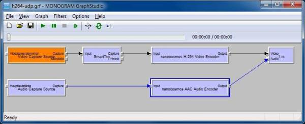
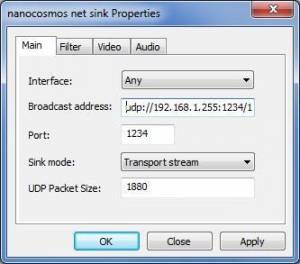
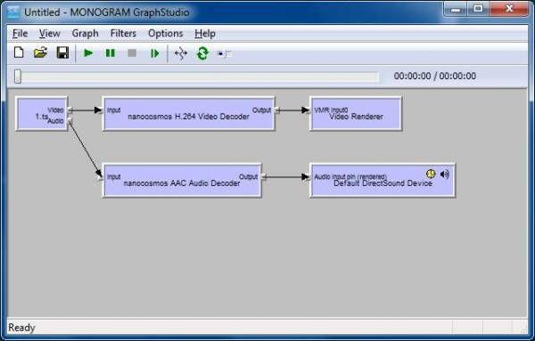

## nanoStream UDP-TS Live Streaming

### General Information
nanoStream 2.0 supports TS Live Streaming Modules for encoding and playback.

### Requirements:

nanoStream Live Video Encoder

#### DirectShow Usage

TS Encoder, based on H.264/AAC and UDP-TS\\
DirectShow Filters used:
  * Nanocosmos H.264 Video Encoder
  * Nanocosmos AAC Audio Encoder
  * Nanocosmos Net UDP Sink

Configuration set the ts url as "udp://server/1.ts"

#### DirectShow Decoding/Playback

DirectShow Filters used:
  * Nanocosmos H.264 Video Decoder
  * Nanocosmos AAC Audio Decoder
  * Nanocosmos Net Source

#### URL Formats:
Example IP Numbers, use your own IP range
  * Unicast/Point-to-point:
    * udp://192.168.1.123:1234/1.ts
  * Broadcast:
    * udp://192.168.1.255:1234/1.ts
  * Multicast:
    * udp://224.0.0.1:1234/1.ts

NetSource and NetSink filters should run in TransportStream mode,indicated by "1.ts" part of the url.\\  
This mode can be selected through the PropertyPage or COM-Interface.\\
It is recommended to do H.264 encoding in Baseline Profile.\\  
H.264 Encoder options can be set through the PropertyPage or COM-Interface.

#### Playback URL Formats:
Usually you can use the same URLs as above, without the 1.ts
Note: For VLC player, you need to add a @ sign before the host.

VLC Examples
  * Unicast/Point-to-point:
    * udp://@192.168.1.123:1234
  * Broadcast:
    * udp://@192.168.1.255:1234
  * Multicast:
    * udp://@224.0.0.1:1234

#### Contact
{!docs/nanostream/general/nanocosmos_contact.md!}
