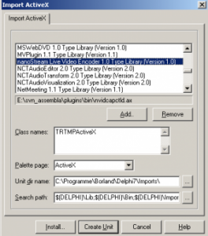
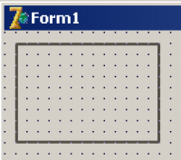
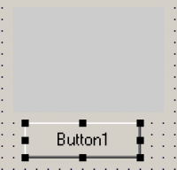

# nanoStream Delphi Integration

nanoStream plugins are based on ActiveX Controls, which can be used from within any development environment.
This document describes how to use the nanoStream plugins from within the Delphi Development IDE.

In a Delphi Project, first *Import ActiveX Control* under the *Component* tab


Search for nanoStream Live Video Encoder.



Create a *RTMP ActiveX* Unit.


On the resulting form, pull an area with the mouse.




Then add a standard button to test nanoStream:




Double Click the button and add this code:
```delphi
procedure TForm1.Button1Click(Sender: TObject);
begin
RTMPActiveX1.InitEncoder;
RTMPActiveX1.StartPreview;
end;
```

Run the project.
Click on the button.
You should see nanoStream running in camera preview mode then.
Add Streaming / Broadcasting to a Media Server
```delphi
RTMPActiveX1.DestinationURL := 'rtmp://example.com/live+delphi123';
RTMPActiveX1.VideoBitrate := 200000;
RTMPActiveX1.StartBroadcast;
```
&nbsp;
